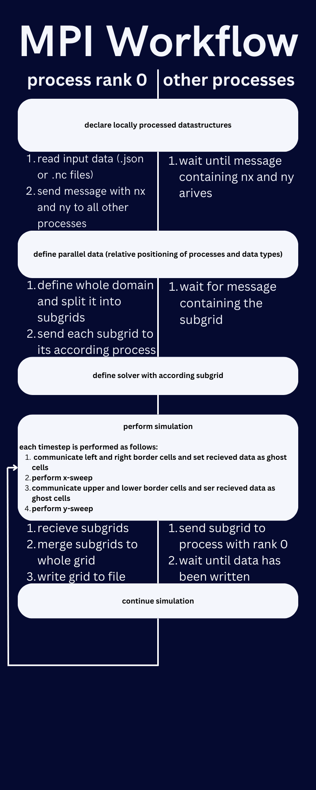

.. _ch:Task_10:

individual Phase - Intermediate Report
======================================

Time Schedule Status
--------------------

In the first week, we wanted to take care of the modularization of our code. 
We achieved this by abstracting and deleting parts of the code that were no longer necessary. 
As a result, only a two-dimensional F-wave simulation can be calculated. We have left the Roe solver and one-dimensionality behind us.

However, we did not deal with the data dependencies for cache optimization, but familiarized ourselves with MPI.
Unfortunately, we encountered more problems than we thought, which is why only the initialization of the parallel data and the first part of the input file reading was completed.

As this puts us behind schedule, the week 4 milestone may not be completed or even started.

What we have done so far
------------------------

Once we had familiarized ourselves with MPI, we had a rough idea of what needed to be done.
We thought about what the workflow for our solver could look like and came to the following flowchart:

