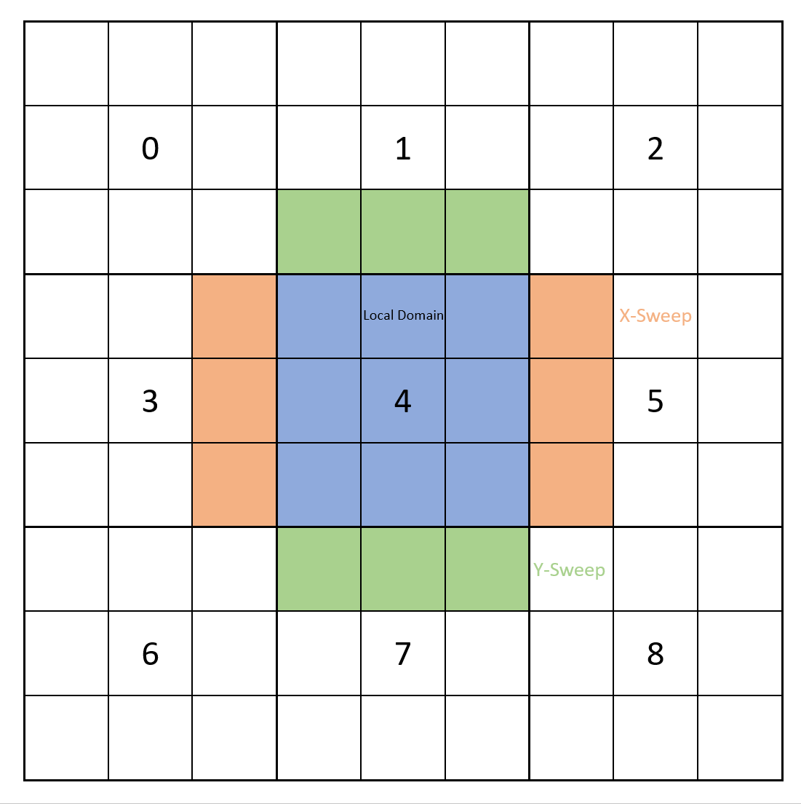

.. _ch:Task_11:

Individual Phase - Final Report
================================

Introduction
------------

With the conclusion of the Tsunami Lab project, our final task was to implement a mechanism of our choosing. The program developed in the project 
takes netCDF data as input, runs the simulation, and outputs the results. Due to the potentially large domain of these input files, the simulation 
can be lengthy. As a result, the simulation may take some time to complete. One way to improve program efficiency is to utilize parallelization, which 
involves instructing multiple cores to run independent parts of the code simultaneously. As dealt with in assignment 9 we already implemented 
parallelization on a smaller scale using OpenMP. Now, our team decided on taking it to a greater scale, splitting our domain into several 
subdomains and running each corresponding simulation on a respective core. Furthermore, to make each simulation more memory efficient, we 
optimize the cache usage. In this section, we will outline the necessary concepts for the optimization process and the strategy we developed 
to integrate them into the simulation.

Methods
-------

Message Passing Interface (MPI)
^^^^^^^^^^^^^^^^^^^^^^^^^^^^^^^

When parallelizing our solver, we have used OpenMP in the past to partially parallelize our code.
OpenMP enables a program to be processed by multiple processors by declaring parallel regions that are executed on each core. 
One solution is to run several processes in parallel, all of which execute the entire code.
However, sharing data and results of local calculations among multiple processors in OpenMP can be complex.
This is where the Message Passing Interface is used.
MPI spawns a certain number of processes each on one respective core. If there were no restrictions, this would result in every process executing exactly the same work.
Therefore, each core has an ID called 'rank' to identify the process running the code and distinguish the work done on each process. 
MPI provides functions to facilitate communication, allowing for the sending and receiving of single or multiple data to or from another processor.

MPI provides a mechanism for arranging the used processes on a Cartesian coordinate system. By using the shifting method, each core can 
determine which processes are adjacent in the grid. When a process relies on n neighbors it is in a so-called n-point stencil.

Parallelizing with MPI requires consideration of blocking and non-blocking communication. Blocking communication requires the sending process to wait for confirmation, that the data has been received and communication has ended. 
Although communication that is blocked is secure, it can result in longer runtimes for large data transfers due to idle time. 
Non-blocking communication functions, on the other hand, run the communication in the background and return immediately after being called, allowing for other tasks to be processed simultaneously. 
This can be used to process other tasks while the communication is ongoing. The MPI_Wait function enables communication synchronization before continuing computation. 
Non-blocking communication can be more complex. This is because a process cannot continue working with the transmitted data until the communication has ended. 
However, if used correctly, it can be faster than working with blocking communication.

Cache
^^^^^

Caches are small, but fast memory units on a processor chip that are supposed to reduce the number of slow memory accesses. They are a less expensive alternative to 
registers which are even faster. Each processor has three levels of cache: the core-specific are the level 1 data (L1D), level 1 instruction (L1I), and level 2 
(L2) cache. The level (L3) cache is shared by the cores on a processor. Memory can only be transferred in a cache line consisting of a specific number of bytes.

If a query does not find the data in the cache, it is referred to as a cache miss; otherwise, it is called a cache hit. When a program queries the memory for a particular 
data, it first looks in the L1D cache; if the data searched for is not found, the search is continued in the next lower level, in this case in the L2 cache, and so on.
If the data is found, its cache line is loaded directly into the L1D cache.

On the Ara cluster [1]_ each Hadoop node consists of 2 Intel Xeon Gold 6140 [2]_ processors with 18 cores each. These have an L1D cache size of 576 KiB, an L2 cache size 
of 18 MiB, and an L3 cache size of 24.75 MiB. In addition, each cache is divided into multiple sets, which are consisting of n lines, which is called an n-way 
set associative cache. Finally, all caches of the processors' caches are write-back, meaning that they write the changes to data in to the memory only when the 
data in the cache needs to be replaced in cache. These specifications must be taken into account when writing cache-optimized code on the Ara cluster.

.. note::
    16 Hadoop nodes on Ara cluster with each:

    - 36 CPU-cores (2x Intel Xeon Gold 6140 18 Core 2,3 Ghz)
    - 192 GB RAM
    - one local SSD

    L1 = 1.125 MiB	
        - L1I	576 KiB	18x32 KiB	8-way set associative	 
        - L1D	576 KiB	18x32 KiB	8-way set associative	write-back

    L2 = 18 MiB
 	 	- 18x1 MiB	16-way set associative	write-back
    
    L3 = 24.75 MiB	
 	 	- 18x1.375 MiB	11-way set associative	write-back

Implementation
--------------

Parallelization with MPI
^^^^^^^^^^^^^^^^^^^^^^^^

In this segment, we explain how we used MPI to fully parallelize our tsunami solver.

Simulation Initialisation
~~~~~~~~~~~~~~~~~~~~~~~~~

To start the simulation all configurations must be set up. 
This process starts with the initialization and declaration of a Cartesian MPI environment and retrieving the information about it on each process. 
To ensure that all the necessary information is readily available, we have introduced the ParallelData struct. In addition, we need to load the configuration file. 
We have decided that each process should load the file individually rather than loading it for one process and sharing the information with others. 
This reduces the amount of communications performed and improves runtime. 

I/O
~~~

The input loading of the bathymetry and displacement files is only performed on the process with the rank 0. For the output, each process writes 
its sub-domain into its own output file. This approach avoids holding we won't have to hold all data of every existing cell on a single core and eliminates the need for 
further communication of whole subgrids.

Domain Decomposition
~~~~~~~~~~~~~~~~~~~~

As only the process with the rank 0 loads the data, it must split the domain into subgrids. This is accomplished by creating four temporary arrays for height, the hu 
(momentum in the x direction), hv (momentum in the y direction), and the bathymetry, each in the size of one subgrid. Once filled with the respective data, all four arrays 
are sent to the process with the corresponding rank using non-blocking communication, allowing all four arrays to be sent simultaneously. When using the temporal arrays for the 
next process, it is important to wait for the communication it is important to complete to ensure no unsend data is overwritten.  

Time Step
~~~~~~~~~

Each process calculates the time step on its own domain. To ensure a correct results on a global scale, the borders of each subgrid must be net-updated by taking into
account of their respective neighboring cells in the neighboring processes. To accomplish this, we fill the ghost cells of a subgrid with the corresponding cells sent by 
the neighbor. Since we use 2-point stencils we have a ghost cell border of the width of one cell. A problem arises when considering the corner ghost cells, for 
which one cell needs to be sent from each diagonal neighbor. To avoid these small extra communications, the communication can be split into one for the
x-sweep and one for the y-sweep. This results in the corner ghost cells being already processed in the x-sweep performed in the process above and below.

  Process with rank 4 recieves orange border cells from processes 3 and 5 before the x-sweep and the green cells (results from the x-sweep) from 1 and 7 before the y-sweep.

The resulting workflow is as follows: First, the vertical borders are sent from the old data to the left and right neighbors. Then the x-sweep is performed. Then we send 
the horizontal borders from the results to the upper and lower neighbors. Finally, we can perform the y-sweep.

Cache optimization
^^^^^^^^^^^^^^^^^^

In order to make the cache usage of our solver more efficient, we first looked at the cache specifications of the ARA cluster Hadoop nodes.

16 Hadoop nodes each with:

    - 36 CPU cores (2x Intel Xeon Gold 6140 18 Core 2.3 Ghz)
    - 192 GB RAM

Intel Xeon Gold 6140 18 Core 2.3 Ghz Cache specifications:

L1 Cache: 8-way set associative, write-back

    L1i = 576 KiB (18 x 32 KiB) 
    L1d = 576 KiB (18 x 32 KiB) 

L2 Cache: 16-way set associative, write-back

    L2 = 18 MiB (18 x 1 MiB) 

L3 Cache: 11-way set associative, write-back

    L3 = 24.75 MiB (18 x 1.375 MiB) 

Anzahl an Sets in Cache: cache size / (block size * set size)

Cache line füllen und dann möglichst alle Operationen durchführen um capacity misses zu minimieren

Alignement check.

Blocking?

Ergebnisse (Berechnungen und vid von Sim)
-----------------------------------------

First things first: we have successfully MPI-parallelized our solver. 
In the following video you can see the simulation of the tsunami event in Chile from 2010 with a magnitude of 8.8 and a cell size of 1000m, divided into 10 subgrids.

.. warning::
    
    vid einfügen von Sim

The borders between the subgrids are caused by the fact that we let each subgrid write its own output file.
Apart from that, the edges are communicated properly and the waves are therefore calculated correctly.

Performance Analysis
^^^^^^^^^^^^^^^^^^^^^^^

In order to measure the change in performance due to MPI parallelisation and compare it with the normal version, we have defined the following test conditions.

All time measurements were carried out using our -t flag and deactivating the output with our -nio flag.
The time used to load and send the input data :math:`T_{init}` and the computation time :math:`T_{comp}` were measured. The overall time :math:`T_{overall}` was calculated by adding the initialization time and the computation time.

.. math::   
    
    T_{overall} &= T_{init} + T_{comp} \\

The speedup can then be calculated by dividing the overall time of the normal version :math:`T_{1}` by the overall time of the mpi parallelization :math:`T_{p}`, where p is the number of processes.

The following table shows the measured values of the initialization time :math:`T_{init}` for :math:`p = {1, 5, 10, 16, 25}` processes, where :math:`p = 1` corresponds to the normal version.

+-----------------------------------+-----------------------------+
| .. centered:: Number of processes | .. centered:: cell size     |
|                                   +---------+---------+---------+
|                                   | 1000m   | 500m    | 250m    |
+-----------------------------------+---------+---------+---------+
| .. centered:: p = 1               | 37.1201 | 147.245 | 592.112 |
+-----------------------------------+---------+---------+---------+
| .. centered:: p = 5               | 86.5288 | 330.326 | 1300.77 |
+-----------------------------------+---------+---------+---------+
| .. centered:: p = 10              | 92.5038 | 366.491 | 1410.27 |
+-----------------------------------+---------+---------+---------+
| .. centered:: p = 16              | /       | 394.263 | 1474.11 |
+-----------------------------------+---------+---------+---------+
| .. centered:: p = 25              | 112.018 | 448.267 | 1695.47 |
+-----------------------------------+---------+---------+---------+

As you can see, one value is missing in the table. This is due to the fact that for :math:`p = 16` processes no domain decomposition can be performed on the 1000m cell size file that fulfills our conditions. 
However, we only noticed this after we had started the measurements, which is why there is no measured value for :math:`p = 16 processes at 1000m cell size in the following tables.

.. warning::
    
    plots?

The following table shows the measured values of the computation time :math:`T_{comp}` for :math:`p = {1, 5, 10, 16, 25}` processes, where :math:`p = 1` corresponds to the normal version.

+-----------------------------------+-----------------------------+
| .. centered:: Number of processes | .. centered:: cell size     |
|                                   +---------+---------+---------+
|                                   | 1000m   | 500m    | 250m    |
+-----------------------------------+---------+---------+---------+
| .. centered:: p = 1               | 357.985 | 5084.05 | 5412.09 |
+-----------------------------------+---------+---------+---------+
| .. centered:: p = 5               | 493.491 | 1308.02 | 2749.71 |
+-----------------------------------+---------+---------+---------+
| .. centered:: p = 10              | 885.82  | 1311.65 | 2482.66 |
+-----------------------------------+---------+---------+---------+
| .. centered:: p = 16              | /       | 1583.94 | 2934.86 |
+-----------------------------------+---------+---------+---------+
| .. centered:: p = 25              | 1832.62 | 2223.12 | 3192.11 |
+-----------------------------------+---------+---------+---------+

.. warning::
    
    plots?

The following table shows the measured values of the overall time :math:`T_{overall}` for :math:`p = {1, 5, 10, 16, 25}` processes, where :math:`p = 1` corresponds to the normal version.

+-----------------------------------+--------------------------------+
| .. centered:: Number of processes | .. centered:: cell size        |
|                                   +----------+----------+----------+
|                                   | 1000m    | 500m     | 250m     |
+-----------------------------------+----------+----------+----------+
| .. centered:: p = 1               | 729.186  | 5231.295 | 6004.202 |
+-----------------------------------+----------+----------+----------+
| .. centered:: p = 5               | 580.0198 | 1638.346 | 4050.48  |
+-----------------------------------+----------+----------+----------+
| .. centered:: p = 10              | 978.3238 | 1678.141 | 3892.93  |
+-----------------------------------+----------+----------+----------+
| .. centered:: p = 16              | /        | 1978.203 | 4408.97  |
+-----------------------------------+----------+----------+----------+
| .. centered:: p = 25              | 1944.638 | 2671.387 | 4887.58  |
+-----------------------------------+----------+----------+----------+

.. warning::
    
    plots?

Discussion
----------

When analyzing the speedups, it is evident that MPI parallelization has a greater impact on the simulations imulations that involve larger amounts of data. This is due 
to the fact that the communication overhead, relative to the compute time needed for a small grid, has a greater impact on the runtime  than on a large grid. 
Additionally, the initialization speed of the grid increases with a larger amount of data, mainly due to the communication of each subgrid. Another reason is that only rank 0 
calculates the values of each grid. To solve this problem, a program should load the data in every process and initialize the data for each subgrid on the respective process.

Since all cache optimizations that we tried to implement failed to provide any speed improvements, we must examine our own methods. The reason for this could be either mistakes on our part or an incorrect methodology.

References
----------

.. [1] Ara cluster specifications: https://wiki.uni-jena.de/pages/viewpage.action?pageId=22453005 (04.02.2024)
.. [2] Intel Xeon Gold 6140 specifications: https://en.wikichip.org/wiki/intel/xeon_gold/6140 (04.02.2024)