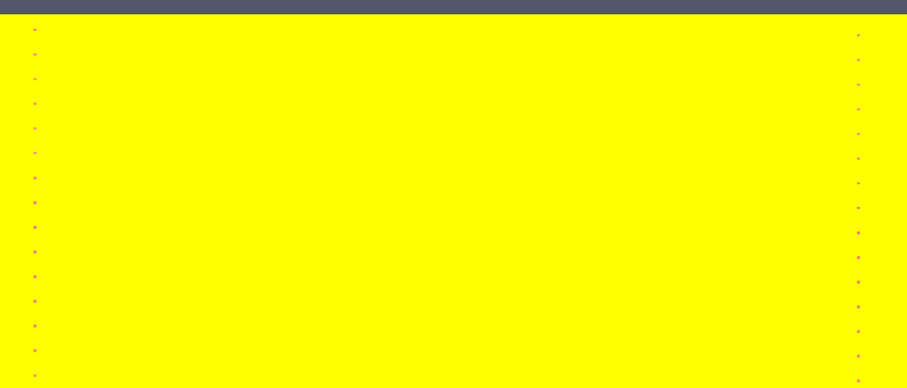

.. _ch:Task_6:

Week Report 6
=============

This week was all about tsunami simulations, and so we simulated various tsunami events with different grid sizes and boundary conditions.

Furthermore, we did all the work on the :code:`phillip.rothenbeck-feature-add.tsunami.event.2d.unit.test` branch, 
since we had problems with merging into the main branch (and it turned out our simulation didn't work, so maybe it was for the best).

Chile 2010 Magnitude 8.8 
------------------------

For the chile tsunami event in 2010 we used the given bathymetry and displacement data netCDF files.

image of bathymetry data plot.

image of displacement data plot.

The simulation length :math:`l_\text{x}` and :math:`l_\text{y}` 
and the offsett :math:`H_\text{x}` and :math:`H_\text{y}` for all grid sizes could be determined from these files.

.. math::

    l_\text{x} &= 500000 - (-3000000) = 3500000 \\
    l_\text{y} &= 1500000 - (-1450000) = 2950000 \\
    H_\text{x} &= -3000000 \\
    H_\text{y} &= -1450000 \\

1000m Grid resolution
^^^^^^^^^^^^^^^^^^^^^^

Since our solver does not allow us to calculate the simulation time :math:`t_\text{sim}` in advance, we have to run the simulation for 1.25 seconds to obtain a value.
It is advised to aim for 100 frames in the output video which are 2500 time steps.

Output of first simulation: 

.. code-block:: c++

    runtime configuration
        number of cells in x-direction: 3500
        number of cells in x-direction: 2950
        cell size                     : 1000
        time step                     : 1.75483
        writing wave field to ./out/solution.nc

The config file for the coarsest resolution of :math:`[1000\text{m}] \times [1000\text{m}]` per grid cell was then filled with values 
for the simulation time :math:`t_\text{sim}` and amount of cells :math:`n_\text{x}` and :math:`n_\text{y}`.

.. math::
    
    t_\text{sim} &= 1.75483 * 2500 = 4387.075 \\
    n_\text{x}   &= \frac{l_\text{x}}{\text{grid size}} = \frac{3500000}{1000} = 3500 \\
    n_\text{y}   &= \frac{l_\text{y}}{\text{grid size}} = \frac{2950000}{1000} = 2950 \\

chile_1000m.json config file:

.. code-block:: c++

    {
        "dimension": 2,
        "nx": 3500,
        "ny": 2950,
        "xLen": 3500000.0,
        "yLen": 2950000.0,
        "bathymetryFileName": "chile_gebco20_usgs_250m_bath_fixed.nc",
        "displacementsFileName": "chile_gebco20_usgs_250m_displ_fixed.nc",
        "epicenterOffsetX": -3000000,
        "epicenterOffsetY": -1450000,
        "simTime": 4388,
        "boundaryCond": "OOOO",
        "setup": "TsunamiEvent"
    }

Unfortunately although the two-dimensional tsunami event from last week works, our simulation seems to clone the coast (or rather the first few x-values) about 6 times.
The expansion in y (and the set values for bathymetry) seems to be correct.

.. image:: ../_static/assignment_6/chile_6.png
    :width: 400

500m Grid resolution
^^^^^^^^^^^^^^^^^^^^

Output of first simulation: 

.. code-block:: c++

    runtime configuration
        number of cells in x-direction: 7000
        number of cells in x-direction: 5900
        cell size                     : 500
        time step                     : 0.877417
        writing wave field to ./out/solution.nc

The configuration file for the average resolution of :math:`[500\text{m}] \times [500\text{m}]` per grid cell was then filled with values 
for the simulation time :math:`t_\text{sim}` and the number of cells:math:`n_\text{x}` and :math:`n_\text{y}`.

.. math::

    t_\text{sim} &= 0.877417 * 2500 = 2193.5425 \\
    n_\text{x}   &= \frac{l_\text{x}}{\text{grid size}} = \frac{3500000}{500} = 7000 \\
    n_\text{y}   &= \frac{l_\text{y}}{\text{grid size}} = \frac{2950000}{500} = 5900 \\

chile_500m.json config file:

.. code-block:: c++

    {
        "dimension": 2,
        "nx": 7000,
        "ny": 5900,
        "xLen": 3500000.0,
        "yLen": 2950000.0,
        "bathymetryFileName": "chile_gebco20_usgs_250m_bath_fixed.nc",
        "displacementsFileName": "chile_gebco20_usgs_250m_displ_fixed.nc",
        "epicenterOffsetX": -3000000,
        "epicenterOffsetY": -1450000,
        "simTime": 2194,
        "boundaryCond": "OO",
        "setup": "TsunamiEvent"
    }

Since our Simulation didn't work with 1000m grid size, we decided to not calculate another bugged coast.

250m Grid resolution
^^^^^^^^^^^^^^^^^^^^^^

Output of first simulation: 

.. code-block:: c++

    runtime configuration
        number of cells in x-direction: 14000
        number of cells in x-direction: 11800
        cell size                     : 250
        time step                     : 0.438709
        writing wave field to ./out/solution.nc

The configuration file for the finest resolution of :math:`[250\text{m}] \times [250\text{m}]` per grid cell was then filled with values 
for the simulation time :math:`t_\text{sim}` and the number of cells :math:`n_\text{x}` and :math:`n_\text{y}`.

.. math::

    t_\text{sim} &= 0.438709 * 2500 = 1096.7725 \\
    n_\text{x}   &= \frac{l_\text{x}}{\text{grid size}} = \frac{3500000}{250} = 14000 \\
    n_\text{y}   &= \frac{l_\text{x}}{\text{grid size}} = \frac{2950000}{250} = 11800 \\

chile_250m.json config file:

.. code-block:: c++

    {
        "dimension": 2,
        "nx": 14000,
        "ny": 11800,
        "xLen": 3500000.0,
        "yLen": 2950000.0,
        "bathymetryFileName": "chile_gebco20_usgs_250m_bath_fixed.nc",
        "displacementsFileName": "chile_gebco20_usgs_250m_displ_fixed.nc",
        "epicenterOffsetX": -3000000,
        "epicenterOffsetY": -1450000,
        "simTime": 1097,
        "boundaryCond": "OO",
        "setup": "TsunamiEvent"
    }

Tohoku 2011 Magnitude 9.1 
--------------------------

For the Tohoku tsunami event in 2011 we used the given bathymetry and displacement data netCDF files.

image of bathymetry data plot.

image of displacement data plot.

The simulation length :math:`l_\text{x}` and :math:`l_\text{y}` 
and the offsett :math:`H_\text{x}` and :math:`H_\text{y}` for all grid sizes could be determined from these files.

.. math::

    l_\text{x} &= 2500000 - (-200000) = 2700000 \\
    l_\text{y} &= 750000  - (-750000) = 1500000 \\
    H_\text{x} &= -200000 \\
    H_\text{y} &= -750000 \\

1000m Grid resolution
^^^^^^^^^^^^^^^^^^^^^^

Output of first simulation: 

.. code-block:: c++

    runtime configuration
        number of cells in x-direction: 2700
        number of cells in x-direction: 1500
        cell size                     : 1000
        time step                     : 1.62332
        writing wave field to ./out/solution.nc

The config file for the coarsest resolution of :math:`[1000\text{m}] \times [1000\text{m}]` per grid cell was then filled with values 
for the simulation time :math:`t_\text{sim}` and amount of cells :math:`n_\text{x}` and :math:`n_\text{y}`.

.. math::

    t_\text{sim} &= 1.62332 * 2500 = 1058.3 \\
    n_\text{x}   &= \frac{l_\text{x}}{\text{grid size}} = \frac{2700000}{1000} = 2700 \\
    n_\text{y}   &= \frac{l_\text{x}}{\text{grid size}} = \frac{1500000}{1000} = 1500 \\

tohoku_1000m.json config file:

.. code-block:: c++

    {
        "dimension": 2,
        "nx": 2700,
        "ny": 1500,
        "xLen": 2700000.0,
        "yLen": 1500000.0,
        "bathymetryFileName": "tohoku_gebco20_usgs_250m_bath.nc",
        "displacementsFileName": "tohoku_gebco20_usgs_250m_displ.nc",
        "epicenterOffsetX": -200000,
        "epicenterOffsetY": -750000,
        "simTime": 4060,
        "boundaryCond": "OOOO",
        "setup": "TsunamiEvent"
    }

Knowing that our simulation was flawed, we expected a cloned, buggy simulation of the Tohoku tsunami event. 
Interestingly, the result of the solver was a file filled with N.a.N. values. (However, there are some places where normal values occur)

We tried to find the error in our code, but as we only noticed it at the end of the week and only in connection with the large simulations, we were unable to find it in time.

Individual Member Contributions
--------------------------------

This week LeChuck did all the work, he deserves most of the credit.