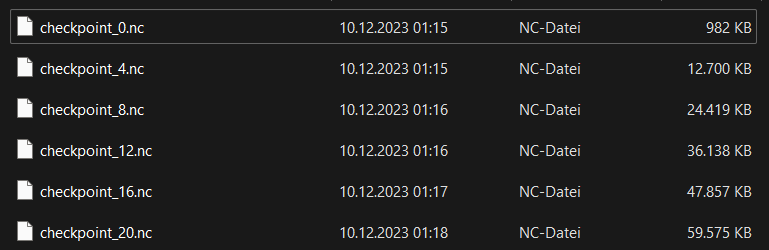

.. _ch:Task_7:

Week Report 7
=============

Checkpoints
-----------

The :code:`NetCDF.cpp` file was revised as part of the checkpointing process. Instead of writing the individual frames directly to the output file each time, 
the class structure is now used to store the data in this file (until there is a write request, e.g. checkpoint).

.. code-block:: c++

    int tsunami_lab::io::NetCDF::store(t_real i_simTime,
                                       t_idx i_frame,
                                       t_real const *i_h,
                                       t_real const *i_hu,
                                       t_real const *i_hv) {
        m_time[i_frame] = i_simTime;

        for (t_idx l_iy = 0; l_iy < m_ny; l_iy++) {
            for (t_idx l_ix = 0; l_ix < m_nx; l_ix++) {
                t_real l_h = i_h[(l_iy + 1) * m_stride + (l_ix + 1)];
                t_real l_b = m_dataB[l_iy * m_nx + l_ix];
                m_height[l_ix + l_iy * m_nx + m_nxy * i_frame] = l_h + l_b;
                m_momentumX[l_ix + l_iy * m_nx + m_nxy * i_frame] = i_hu[(l_iy + 1) * m_stride + (l_ix + 1)];
                m_momentumY[l_ix + l_iy * m_nx + m_nxy * i_frame] = i_hv[(l_iy + 1) * m_stride + (l_ix + 1)];
            }
        }

        return 0;
    }

In order for the checkpoints to fulfill their purpose, they must contain all the information that is normally contained in the output file (h, hv, hu, bathymetry, ...). 
This also ensures that the checkpoint files can be displayed in Paraview in the same way as the output files.

Furthermore the Simulation time :code:`SimTime` and End time :code:`EndTime` are also saved so that we can keep track of how far we have simulated and when we need to set the next checkpoint.

The question of the time intervals between checkpoints is clarified in the :code:`Simulation.cpp` file. 
We have opted for a variable amount of Checkpoints, which can be changed in the corresponding configuration file (per default ... Checkpoints per Simulation).

The time interval between checkpoints is calculated by: :math:` \text{simTime}` % :math:`\frac{\text{endTime}}{n_\text{Checkpoints}}`

There is no writeCheckpoint function or whatsoever. The :code:`write` function can be called with or without parameters, which determines how it is used. 

Each time a checkpoint is set, the function is called with parameters and in the end, when the solution file is to be written, no parameters are used.

:code:`write` calls in Simulator.cpp:

.. code-block:: c++

        // iterate over time
        while (l_simTime < l_endTime) {
            if (l_timeStep % 25 == 0) {
                std::cout << "  simulation time / #time steps / #step: "
                          << l_simTime << " / " << l_timeStep << " / " << l_frame << std::endl;

                l_writer->store(l_simTime,
                                l_frame,
                                l_waveProp->getHeight(),
                                l_waveProp->getMomentumX(),
                                l_waveProp->getMomentumY());

					 if (l_frame % 4 == 0) {
						l_writer->write(l_frame, l_checkpoint, l_simTime, l_endTime);
						l_checkpoint++;
					 }
                l_frame++;
            }
            l_waveProp->setGhostCells(i_simConfig.getBoundaryCondition());
            l_waveProp->timeStep(l_scalingX, l_scalingY);

            l_timeStep++;
            l_simTime += l_dt;
        }

        l_writer->write();

        // free memory
        std::cout << "finished time loop" << std::endl;
        std::cout << "freeing memory" << std::endl;
        delete l_writer;

NetCDF :code:`write` function:

.. code-block:: c++

    int tsunami_lab::io::NetCDF::write(t_idx i_currentFrame,
                                       long int i_checkpoint = -1,
                                       t_real i_simTime = -1,
                                       t_real i_endTime = -1) {
        int l_nc_err = 0;

        // create netCDF file
        std::string l_outFileName;
        if (i_checkpoint > -1) {
            l_outFileName = "out/checkpoint_" + std::to_string(i_checkpoint) + ".nc";
        } else {
            l_outFileName = m_outFileName;
        }
        std::cout << l_outFileName << std::endl;
        l_nc_err += nc_create((l_outFileName).c_str(), NC_CLOBBER, &m_ncId);
        if (l_nc_err != NC_NOERR) {
            std::cerr << "NCError: Create file." << std::endl;
            return 1;
        }

        // define dims and vars
        init(i_currentFrame);

        // write data
        l_nc_err = nc_put_var_float(m_ncId, m_varXId, m_dataX);
        l_nc_err += nc_put_var_float(m_ncId, m_varYId, m_dataY);
        l_nc_err += nc_put_var_float(m_ncId, m_varBathymetryId, m_dataB);
        l_nc_err += nc_put_var_float(m_ncId, m_varTimeId, m_time);
        l_nc_err += nc_put_var_float(m_ncId, m_varHeightId, m_height);
        l_nc_err += nc_put_var_float(m_ncId, m_varMomentumXId, m_momentumX);
        l_nc_err += nc_put_var_float(m_ncId, m_varMomentumYId, m_momentumY);
        if (i_simTime != -1) {
            t_real l_simTime[1] = {i_simTime};
            l_nc_err += nc_put_var_float(m_ncId, m_varSimTimeId, l_simTime);
        }
        if (i_endTime != -1) {
            t_real l_endTime[1] = {i_endTime};
            l_nc_err += nc_put_var_float(m_ncId, m_varEndTimeId, l_endTime);
        }
        if (l_nc_err != NC_NOERR) {
            std::cout << "NCError: Put variables." << std::endl;
            return 1;
        }

        l_nc_err = nc_close(m_ncId);
        if (l_nc_err != NC_NOERR) {
            std::cout << "NCError: Close file." << std::endl;
            return 1;
        }

        return NC_NOERR;
    }

    int tsunami_lab::io::NetCDF::write() {
        return write(m_frameCount);
    }

If there are older checkpoints, but you want to recalculate everything, there is a command line flag :code:`C` which can be used to ignore the existing checkpoints.

.. code-block:: c++

    ./build/tsunami_lab/ chile_250m.json -C 

We do not delete old checkpoint files using the code, as this is eventually done by hand.

picture of Checkpoint files:

Coarse Output
-------------

To obtain a coarse output, several cells in a square must be combined into one cell. This works by iterating over the grid and taking every :math:`k \text{'th}` cell and using a :math:`2k-1 \times 2k-1` filter (similar to a blur filter in image processing).
The value of the cells is being divided by the number of cells in the square, typically :math:`(2k-1)^2` , and added together.
But it raises the question of what happens to cells that do not exist because they are outside the domain. If :math:`k = 5` then there are not enough ghost cells at the edge to combine the cells.
In this case cells outside of the domain are ignored and the value of each cells is divided by :math:`(2k-1)^2 - n_\text{ignored cells}`

.. code-block:: c++

        // coarse output
        t_idx l_idx = 0;
        t_real *l_dataX = new tsunami_lab::t_real[m_nxCoarse];
        for (t_idx l_ix = m_coarseFactor - 1; l_ix < m_nx; l_ix += m_coarseFactor) {
            l_dataX[l_idx] = m_dataX[l_ix];
            l_idx += 1;
        }
        l_nc_err = nc_put_var_float(m_ncId, m_varXId, l_dataX);
        delete[] l_dataX;

        l_idx = 0;
        t_real *l_dataY = new tsunami_lab::t_real[m_nyCoarse];
        for (t_idx l_iy = m_coarseFactor - 1; l_iy < m_ny; l_iy += m_coarseFactor) {
            l_dataY[l_idx] = m_dataY[l_iy];
            l_idx += 1;
        }
        l_nc_err += nc_put_var_float(m_ncId, m_varYId, l_dataY);
        delete[] l_dataY;

        l_idx = 0;
        t_real *l_dataB = new tsunami_lab::t_real[m_nxyCoarse];
        for (t_idx l_iy = m_coarseFactor - 1; l_iy < m_ny; l_iy += m_coarseFactor) {
            for (t_idx l_ix = m_coarseFactor - 1; l_ix < m_nx; l_ix += m_coarseFactor) {
                // average over neighbors
                l_dataB[l_idx] = m_dataB[l_iy * m_nx + l_ix];
                t_idx l_neighborCount = 1;
                for (int l_offsetY = -(m_coarseFactor - 1); l_offsetY < (int)m_coarseFactor; l_offsetY++) {
                    for (int l_offsetX = -(m_coarseFactor - 1); l_offsetX < (int)m_coarseFactor; l_offsetX++) {
                        int l_idxX = l_ix + l_offsetX;
                        int l_idxY = l_iy + l_offsetY;
                        if (tsunami_lab::io::NetCDF::isInBounds(l_idxX, l_idxY)) {
                            l_dataB[l_idx] += m_dataB[l_idxY * m_nx + l_idxX];
                            l_neighborCount++;
                        }
                    }
                }
                l_dataB[l_idx] /= l_neighborCount;
                l_idx += 1;
            }
        }
        l_nc_err += nc_put_var_float(m_ncId, m_varBathymetryId, l_dataB);
        delete[] l_dataB;

        l_idx = 0;
        t_real *l_height = new tsunami_lab::t_real[m_nxyCoarse];
        t_real *l_momentumX = new tsunami_lab::t_real[m_nxyCoarse];
        t_real *l_momentumY = new tsunami_lab::t_real[m_nxyCoarse];
        for (t_idx l_iy = m_coarseFactor - 1; l_iy < m_ny; l_iy += m_coarseFactor) {
            for (t_idx l_ix = m_coarseFactor - 1; l_ix < m_nx; l_ix += m_coarseFactor) {
                // average over neighbors
                l_height[l_idx] = m_height[l_iy * m_nx + l_ix];
                l_momentumY[l_idx] = m_momentumY[l_iy * m_nx + l_ix];
                l_momentumY[l_idx] = m_momentumY[l_iy * m_nx + l_ix];
                t_idx l_neighborCount = 1;
                for (int l_offsetY = -(m_coarseFactor - 1); l_offsetY < (int)m_coarseFactor; l_offsetY++) {
                    for (int l_offsetX = -(m_coarseFactor - 1); l_offsetX < (int)m_coarseFactor; l_offsetX++) {
                        int l_idxX = l_ix + l_offsetX;
                        int l_idxY = l_iy + l_offsetY;
                        if (tsunami_lab::io::NetCDF::isInBounds(l_idxX, l_idxY)) {
                            l_height[l_idx] += m_height[l_idxY * m_nx + l_idxX];
                            l_momentumX[l_idx] += m_momentumX[l_idxY * m_nx + l_idxX];
                            l_momentumY[l_idx] += m_momentumY[l_idxY * m_nx + l_idxX];
                            l_neighborCount++;
                        }
                    }
                }
                l_height[l_idx] /= l_neighborCount;
                l_momentumX[l_idx] /= l_neighborCount;
                l_momentumY[l_idx] /= l_neighborCount;
                l_idx += 1;
            }
        }

Simulation of 2011 Tohoku with coarse Output
^^^^^^^^^^^^^^^^^^^^^^^^^^^^^^^^^^^^^^^^^^^^

As time was short at the end, we simulated chile at 1000m grid size. One time with a coarse output modifire of :math:`k = 20` and one time without to show the difference.

Visualization of chile 1000m with coarse Output:

.. image:: ../_static/assignment_7/
  :width: 400

Visualization of chile 1000m without coarse Output:

.. image:: ../_static/assignment_7/
  :width: 400

