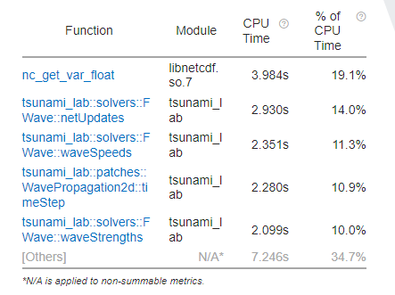
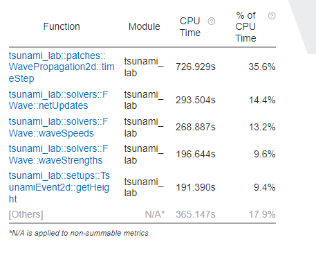

.. _ch:Task_8:

Week Report 8
=============

Migration to ARA
----------------

The migration from LeChuck to the ARA cluster went without any major problems.

The following batch script was used to simulate the 2010 tsunami in Chile (and thus prove the functionality of the solver):

.. code-block:: c++

    #!/bin/bash
    #SBATCH --job-name=tsunami
    #SBATCH --output=tsunami.out
    #SBATCH --error=tsunami.err
    #SBATCH --partition=s_hadoop
    #SBATCH --nodes=1
    #SBATCH --ntasks=1
    #SBATCH --time=10:00:00
    #SBATCH --cpus-per-task=72

    # Load modules
    module load tools/python/3.8
    module load compiler/gcc/11.2.0
    python3.8 -m pip install --user scons

    date
    cd /beegfs/ri26lit/tsunami_lab
    scons
    ./build/tsunami_lab chile_10000m.json

with the corresponding config file chile_10000m.json:

.. code-block:: c++

    {
        "dimension": 2,
        "nx": 350,
        "ny": 295,
        "xLen": 3500000.0,
        "yLen": 2950000.0,
        "bathymetryFileName": "chile_gebco20_usgs_250m_bath_fixed.nc",
        "displacementsFileName": "chile_gebco20_usgs_250m_displ_fixed.nc",
        "epicenterOffsetX": -3000000.0,
        "epicenterOffsetY": -1450000.0,
        "simTime": 44300,
        "boundaryCond": "OO",
        "setup": "TsunamiEvent"
        "checkPoints": 2
    }

The visualization of the 2010 chile tsunami event seems to work as intended:

.. video:: ../_static/assignment_8/chile_10000m.mp4
  :autoplay:
  :loop:
  :height: 300
  :width: 650

Comparison of ARA vs. home system
^^^^^^^^^^^^^^^^^^^^^^^^^^^^^^^^^

To show the difference in calculation time between the ara cluster and our own system, the chile tsunami event was simulated with a grid size of 10000m.

We decided not to use the time per cell and iteration, but the time of the entire simulation (file I/O and setup time excluded).

home system: :math:`\text{AMD Ryzen}^ \text{TM}` 7 4700U @ 2.00GHz (RAM: 24.00GB @ 3200MHz)

.. code-block::

    simulation time / #time steps / #step: 43439 / 2450 / 98
    simulation time / #time steps / #step: 43882.2 / 2475 / 99
    Simulation Took: 18.9094s
    ./out/chile_10000m.nc
    finished time loop
    freeing memory
    finished, exiting

ARA-Cluster: :math:`\text{Skylake Intel}^ \text{®}` :math:`\text{Xeon}^ \text{®}` Gold 6140 @ 2.30GHz (RAM: 192GB)

.. code-block::

    simulation time / #time steps / #step: 43439 / 2450 / 98
    simulation time / #time steps / #step: 43882.2 / 2475 / 99
    Simulation Took: 13.1988s
    ./out/chile_10000m.nc
    finished time loop
    freeing memory
    finished, exiting

As expected (since the hardware on ARA is better), the ARA cluster seems to be roughly 43% faster than our home system. 
That's not a huge difference, especially when you consider that our home system is a five year old laptop.

Interchangeability of compilers
-------------------------------

Implemented compiler interchangeability in sconstruct by adding a new variable :code:`CXX` with default value :code:`g++`. The Compiler can be set just like the mode with :code:`scons CXX=icpc`. 
In addition, the environment :code:`env` has been extended by the addition of :code:`ENV=os.environ`.
The default flag for :code:`g++` and :code:`icpc` is :code:`-O2`.

.. code-block::

    vars.AddVariables(
      EnumVariable( 'CXX',
                    'compiler options: g++, icpc',
                    'g++',
                    allowed_values=('g++', 'icpc')
                  )
    )

    # ...

    # create environment
    env = Environment( ENV=os.environ, variables = vars )

    print(f"use the {env['CXX']} compiler")

    # ...

    # set optimization mode
    if 'debug' in env['mode']:
    env.Append( CXXFLAGS = [ '-O0' ] )
    else:
    if 'g++' in env['CXX']:
        env.Append( CXXFLAGS = [ '-O2' ] )
    elif 'icpc' in env['CXX']:
        env.Append( CXXFLAGS = [ '-O2' ] )

If you compare the time required by both compilers, the g++ compiler is faster than icpc, but the code itself runs faster if it is generated with icpc.

Comparison of different optimization switches
^^^^^^^^^^^^^^^^^^^^^^^^^^^^^^^^^^^^^^^^^^^^^

The comparison of the two compilers was conducted by the tsunami event in Chile with a grid size of 10000m.

corresponding chile_10000m.json config file:

.. code-block:: c++

    {
        "dimension": 2,
        "nx": 350,
        "ny": 295,
        "xLen": 3500000.0,
        "yLen": 2950000.0,
        "bathymetryFileName": "chile_gebco20_usgs_250m_bath_fixed.nc",
        "displacementsFileName": "chile_gebco20_usgs_250m_displ_fixed.nc",
        "epicenterOffsetX": -3000000.0,
        "epicenterOffsetY": -1450000.0,
        "simTime": 44300,
        "boundaryCond": "OO",
        "setup": "TsunamiEvent"
        "checkPoints": 2
    }

We used the time that the simulation took (in seconds), excluding file I/O and setup time.

+---------------+----------+----------+
| Configuration |   g++    |   icpc   |
+===============+==========+==========+
|       O2      | 13.1988s | 12.6979s |
+---------------+----------+----------+
|      Ofast    | 11.1114s |  13.11s  |
+---------------+----------+----------+
|      fast     |          | 10.9384s |
+---------------+----------+----------+

In direct comparison with the O2 flag, the icpc compiler generated slightly faster code.
Unexpectedly, with the ofast flag, the g++ compiler generated faster code compared to the icpc compiler.
Since only the icpc compiler could be executed with the fast flag, we have no comparison with the g++ compiler. 
It could be assumed that the g++ compiler would have become even faster, since 'fast' is a combination of 'Ofast', 'ipo', 'static' and 'xHost'.

Based on these results, we decided not to set our default flag for :code:`g++` to :code:`-Ofast` since it contains the :code:`O3` flag, 
which is recommended when working with loops involving intensive floating point calculations but generates unstable code.
The default flag for :code:`icpc` was set to :code:`fast`.

Optimization Report
^^^^^^^^^^^^^^^^^^^^

Added an option for compiler optimization reports in Sconstruct.

.. code-block::

    vars.AddVariables(
      EnumVariable( 'report',
                    'options: 0 to 5',
                    '0',
                    allowed_values=('0', '1', '2', '3', '4', '5')
                  )
    )

    # ...

    if 'icpc' in env['CXX'] and '0' not in env['report']:
      env.Append( CXXFLAGS = [ '-qopt-report=' + env['report'] ] )

According to the report, the Roe-solver can be inlined, but not the FWave-solver or Wavepropagation2d, as this would exceed the :code:`-inline-max-size` value.
Furthermore, the compiler is not able to vectorize our loops (getbathymetry and getheight) because there are too many vector dependencies.

Instrumentation and Perfmance Counters
--------------------------------------

To gain additional insight into our code and its optimization, we used Intel Vtune Profile. 
Once again, the tsunami simulation of Chile with a grid size of 10000m was used.

.. code-block:: c++

    {
        "dimension": 2,
        "nx": 350,
        "ny": 295,
        "xLen": 3500000.0,
        "yLen": 2950000.0,
        "bathymetryFileName": "chile_gebco20_usgs_250m_bath_fixed.nc",
        "displacementsFileName": "chile_gebco20_usgs_250m_displ_fixed.nc",
        "epicenterOffsetX": -3000000.0,
        "epicenterOffsetY": -1450000.0,
        "simTime": 44300,
        "boundaryCond": "OO",
        "setup": "TsunamiEvent"
        "checkPoints": 2
    }

First, we looked into the :code:`Hotspots` with the following batch script:

.. code-block:: c++

    #!/bin/bash
    #SBATCH --job-name=tsunami
    #SBATCH --output=tsunami.out
    #SBATCH --error=tsunami.err
    #SBATCH --partition=s_hadoop
    #SBATCH --nodes=1
    #SBATCH --ntasks=1
    #SBATCH --time=10:00:00
    #SBATCH --cpus-per-task=72

    # Load necessary modules
    module load tools/python/3.8
    module load compiler/gcc/11.2.0
    module load compiler/intel/2020-Update2
    python3.8 -m pip install --user scons

    date
    cd /beegfs/ri26lit/tsunami_lab
    scons CXX=icpc
    vtune -collect hotspots ./build/tsunami_lab chile_10000m.json

And then we looked into :code:`Threading` (same code, only last line has changed):

.. code-block:: c++

    #!/bin/bash
    #SBATCH --job-name=tsunami
    #SBATCH --output=tsunami.out
    #SBATCH --error=tsunami.err
    #SBATCH --partition=s_hadoop
    #SBATCH --nodes=1
    #SBATCH --ntasks=1
    #SBATCH --time=10:00:00
    #SBATCH --cpus-per-task=72

    # Load necessary modules
    module load tools/python/3.8
    module load compiler/gcc/11.2.0
    module load compiler/intel/2020-Update2
    python3.8 -m pip install --user scons

    date
    cd /beegfs/ri26lit/tsunami_lab
    scons CXX=icpc
    vtune -collect threading ./build/tsunami_lab chile_10000m.json

The results in the Intel Vtune Profiler GUI for chile_10000m showed that a lot of CPU time is used for the :code:`nc_get_var_float` in our netCDF reader.
We already knew that we might have overused :code:`nc_get_var_float`, but we did not expect it to be so dominant.

Suspecting that there were other obvious bottlenecks, we ran chile again, but this time with a grid size of 1000m.

As expected, this time Wavepropagation2d clearly stood out with about 35% of the CPU time. 
NetUpdates and WaveSpeeds required roughly the same amount of CPU time as in the simulation above and therefore took second and third place.

Individual Phase
----------------

For our individual phase, we would like to try to optimize our solver by dividing our mesh into several smaller meshes. These smaller meshes can be simulated simultaneously on different cores to calculate the net updates faster. The challenge is to update the intersections of these smaller meshes at each time step.

We hope that by parallelizing our computations, we can gain a lot of computing power. We also hope to deepen our understanding of good parallelization practices. 

As a second option, we would like to improve our solver by implementing adaptive mesh refinement to improve the resolution in areas of interest. For this we can use the paper *Adaptive Mesh Refinement Using Wave-Propagation Algorithms for Hyperbolic Systems* by Marsha J. Berger and Randall J. LeVeque.