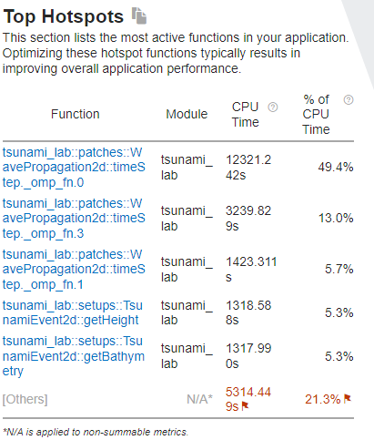
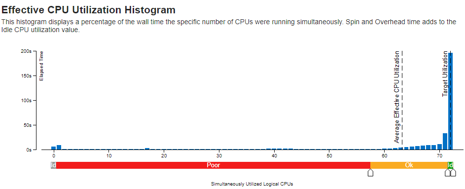

.. _ch:Task_9:

Weekly Report 9
===============

Parallelization
----------------

For parallelization, we concentrated on Simulator.cpp (solver setup), NetCDF.cpp (coarse Output) and Wavepropagation2d (timeStep).

All tests were performed with a grid size of 10000m and a coarse-factor of 50m.

chile_10000mCoarse.json config file:

.. code-block:: c++

    {
        "dimension": 2,
        "nx": 350,
        "ny": 295,
        "xLen": 3500000.0,
        "yLen": 2950000.0,
        "bathymetryFileName": "chile_gebco20_usgs_250m_bath_fixed.nc",
        "displacementsFileName": "chile_gebco20_usgs_250m_displ_fixed.nc",
        "epicenterOffsetX": -3000000.0,
        "epicenterOffsetY": -1450000.0,
        "simTime": 44300,
        "boundaryCond": "OO",
        "setup": "TsunamiEvent",
        "coarseFactor": 50
    }

Enabled OpenMP support for GNU and Intel compilers in Sconstruct:

.. code-block::

    # set optimization mode
    if 'debug' in env['mode']:
    env.Append( CXXFLAGS = [ '-O0' ] )
    else:
    if 'g++' in env['CXX']:
        env.Append( CXXFLAGS = [ '-O2' ] )
    elif 'icpc' in env['CXX']:
        env.Append( CXXFLAGS = [ '-fast' ] )

    if 'g++' in env['CXX']:
        env.Append( CXXFLAGS = [ '-fopenmp' ] )
        env.Append( LINKFLAGS = [ '-fopenmp' ] )
    elif 'icpc' in env['CXX']:
        env.Append( CXXFLAGS = [ '-qopenmp' ] )
        env.Append( LINKFLAGS = [ '-qopenmp' ] )

parallelization in Simulator:
^^^^^^^^^^^^^^^^^^^^^^^^^^^^^^

code before parallelization:

.. code-block:: c++

    // set up solver
    for (tsunami_lab::t_idx l_cy = 0; l_cy < l_ny; l_cy++) {
        tsunami_lab::t_real l_y = l_cy * l_dy;

        for (tsunami_lab::t_idx l_cx = 0; l_cx < l_nx; l_cx++) {
            tsunami_lab::t_real l_x = l_cx * l_dx;

code after parallelization:

.. code-block:: c++

    // set up solver
    #pragma omp parallel for collapse(2) schedule(static, 8) reduction(max : l_hMax)
        for (tsunami_lab::t_idx l_cy = 0; l_cy < l_ny; l_cy++) {
            for (tsunami_lab::t_idx l_cx = 0; l_cx < l_nx; l_cx++) {
                tsunami_lab::t_real l_y = l_cy * l_dy;
                tsunami_lab::t_real l_x = l_cx * l_dx;

Speedup :math:`S_p` with :math:`T_1 = 2078.36s` and :math:`T_p = 37.2162s` for :math:`p = 72` cores: 

.. math::   
    
    S_p &= \frac{T_1}{T_p} \\
    S_{72} &= \frac{2078.36s}{37.2162s} = 55.845

parallelization in NetCDF:
^^^^^^^^^^^^^^^^^^^^^^^^^^

code before parallelization:

.. code-block:: c++

            // coarse output
            t_idx l_idx = 0;
            t_real *l_dataX = new tsunami_lab::t_real[m_nxCoarse];
            for (t_idx l_ix = m_coarseFactor - 1; l_ix < m_nx; l_ix += m_coarseFactor) {
                l_dataX[l_idx] = m_dataX[l_ix];
                l_idx += 1;
            }
            l_nc_err = nc_put_var_float(m_ncId, m_varXId, l_dataX);
            delete[] l_dataX;

            l_idx = 0;
            t_real *l_dataY = new tsunami_lab::t_real[m_nyCoarse];
            for (t_idx l_iy = m_coarseFactor - 1; l_iy < m_ny; l_iy += m_coarseFactor) {
                l_dataY[l_idx] = m_dataY[l_iy];
                l_idx += 1;
            }
            l_nc_err += nc_put_var_float(m_ncId, m_varYId, l_dataY);
            delete[] l_dataY;

            l_idx = 0;
            t_real *l_dataB = new tsunami_lab::t_real[m_nxyCoarse];
            for (t_idx l_iy = m_coarseFactor - 1; l_iy < m_ny; l_iy += m_coarseFactor) {
                for (t_idx l_ix = m_coarseFactor - 1; l_ix < m_nx; l_ix += m_coarseFactor) {
                    // average over neighbors
                    l_dataB[l_idx] = m_dataB[l_iy * m_nx + l_ix];
                    t_idx l_neighborCount = 1;
                    if (m_coarseFactor != 1) {
                        for (int l_offsetY = -(m_coarseFactor - 1); l_offsetY < (int)m_coarseFactor; l_offsetY++) {
                            for (int l_offsetX = -(m_coarseFactor - 1); l_offsetX < (int)m_coarseFactor; l_offsetX++) {
                                int l_idxX = l_ix + l_offsetX;
                                int l_idxY = l_iy + l_offsetY;
                                if (tsunami_lab::io::NetCDF::isInBounds(l_idxX, l_idxY)) {
                                    l_dataB[l_idx] += m_dataB[l_idxY * m_nx + l_idxX];
                                    l_neighborCount++;
                                }
                            }
                        }
                    }
                    l_dataB[l_idx] /= l_neighborCount;
                    l_idx += 1;
                }
            }
            l_nc_err += nc_put_var_float(m_ncId, m_varBathymetryId, l_dataB);
            delete[] l_dataB;

            l_idx = 0;
            t_real *l_height = new tsunami_lab::t_real[m_nxyCoarse * m_frameCount];
            t_real *l_momentumX = new tsunami_lab::t_real[m_nxyCoarse * m_frameCount];
            t_real *l_momentumY = new tsunami_lab::t_real[m_nxyCoarse * m_frameCount];
            for (t_idx l_frame = 0; l_frame < m_frameCount; l_frame++) {
                for (t_idx l_iy = m_coarseFactor - 1; l_iy < m_ny; l_iy += m_coarseFactor) {
                    for (t_idx l_ix = m_coarseFactor - 1; l_ix < m_nx; l_ix += m_coarseFactor) {
                        // average over neighbors
                        t_idx l_framedIdx = (l_iy * m_nx + l_ix) + m_nxy * l_frame;
                        l_height[l_idx] = m_height[l_framedIdx];
                        l_momentumX[l_idx] = m_momentumX[l_framedIdx];
                        l_momentumY[l_idx] = m_momentumY[l_framedIdx];
                        t_idx l_neighborCount = 1;
                        if (m_coarseFactor != 1) {
                            for (int l_offsetY = -(m_coarseFactor - 1); l_offsetY < (int)m_coarseFactor; l_offsetY++) {
                                for (int l_offsetX = -(m_coarseFactor - 1); l_offsetX < (int)m_coarseFactor; l_offsetX++) {
                                    int l_idxX = l_ix + l_offsetX;
                                    int l_idxY = l_iy + l_offsetY;
                                    if (tsunami_lab::io::NetCDF::isInBounds(l_idxX, l_idxY)) {
                                        t_idx l_framedIdxOffset = (l_idxY * m_nx + l_idxX) + m_nxy * l_frame;
                                        l_height[l_idx] += m_height[l_framedIdxOffset];
                                        l_momentumX[l_idx] += m_momentumX[l_framedIdxOffset];
                                        l_momentumY[l_idx] += m_momentumY[l_framedIdxOffset];
                                        l_neighborCount++;
                                    }
                                }
                            }
                        }
                        l_height[l_idx] /= l_neighborCount;
                        l_momentumX[l_idx] /= l_neighborCount;
                        l_momentumY[l_idx] /= l_neighborCount;
                        l_idx += 1;
                    }
                }
            }
            l_nc_err += nc_put_var_float(m_ncId, m_varHeightId, l_height);
            l_nc_err += nc_put_var_float(m_ncId, m_varMomentumXId, l_momentumX);
            l_nc_err += nc_put_var_float(m_ncId, m_varMomentumYId, l_momentumY);
            delete[] l_height;
            delete[] l_momentumX;
            delete[] l_momentumY;
        }

code after parallelization:

.. code-block:: c++

    // coarse output
            t_real *l_dataX = new tsunami_lab::t_real[m_nxCoarse];
    #pragma omp parallel for schedule(static, 16)
            for (t_idx l_idx = 0; l_idx < m_nxCoarse; l_idx++) {
                t_idx l_ix = m_coarseFactor - 1 + (l_idx * m_coarseFactor);
                l_dataX[l_idx] = m_dataX[l_ix];
            }
            l_nc_err = nc_put_var_float(m_ncId, m_varXId, l_dataX);
            delete[] l_dataX;

            t_real *l_dataY = new tsunami_lab::t_real[m_nyCoarse];
    #pragma omp parallel for schedule(static, 16)
            for (t_idx l_idx = 0; l_idx < m_nyCoarse; l_idx++) {
                t_idx l_iy = m_coarseFactor - 1 + (l_idx * m_coarseFactor);
                l_dataY[l_idx] = m_dataY[l_iy];
            }
            l_nc_err += nc_put_var_float(m_ncId, m_varYId, l_dataY);
            delete[] l_dataY;

            t_real *l_dataB = new tsunami_lab::t_real[m_nxyCoarse];
    #pragma omp parallel for schedule(static, 8)
            for (t_idx l_idx = 0; l_idx < m_nxyCoarse; l_idx++) {
                t_idx l_ix = m_coarseFactor * (l_idx % m_nxCoarse) + m_coarseFactor - 1;
                t_idx l_iy = m_coarseFactor * (t_idx)std::floor(l_idx / m_nxCoarse) + m_coarseFactor - 1;
                // average over neighbors
                l_dataB[l_idx] = m_dataB[l_iy * m_nx + l_ix];
                t_idx l_neighborCount = 1;
                if (m_coarseFactor != 1) {
                    for (int l_offsetY = -(m_coarseFactor - 1); l_offsetY < (int)m_coarseFactor; l_offsetY++) {
                        for (int l_offsetX = -(m_coarseFactor - 1); l_offsetX < (int)m_coarseFactor; l_offsetX++) {
                            int l_idxX = l_ix + l_offsetX;
                            int l_idxY = l_iy + l_offsetY;
                            if (tsunami_lab::io::NetCDF::isInBounds(l_idxX, l_idxY)) {
                                l_dataB[l_idx] += m_dataB[l_idxY * m_nx + l_idxX];
                                l_neighborCount++;
                            }
                        }
                    }
                }
                l_dataB[l_idx] /= l_neighborCount;
            }
            l_nc_err += nc_put_var_float(m_ncId, m_varBathymetryId, l_dataB);
            delete[] l_dataB;

            t_real *l_height = new tsunami_lab::t_real[m_nxyCoarse * m_frameCount];
            t_real *l_momentumX = new tsunami_lab::t_real[m_nxyCoarse * m_frameCount];
            t_real *l_momentumY = new tsunami_lab::t_real[m_nxyCoarse * m_frameCount];
    #pragma omp parallel for schedule(static, 16)
            for (t_idx l_idx = 0; l_idx < m_nxyCoarse * m_frameCount; l_idx++) {
                // average over neighbors
                t_idx l_frame = std::floor(l_idx / m_nxyCoarse);
                t_idx l_ix = m_coarseFactor * (l_idx % m_nxCoarse) + m_coarseFactor - 1;
                t_idx l_iy = m_coarseFactor * (t_idx)std::floor((l_idx % m_nxyCoarse) / m_nxCoarse) + m_coarseFactor - 1;
                t_idx l_framedIdx = (l_iy * m_nx + l_ix) + m_nxy * l_frame;
                l_height[l_idx] = m_height[l_framedIdx];
                l_momentumX[l_idx] = m_momentumX[l_framedIdx];
                l_momentumY[l_idx] = m_momentumY[l_framedIdx];
                t_idx l_neighborCount = 1;
                if (m_coarseFactor != 1) {
                    for (int l_offsetY = -(m_coarseFactor - 1); l_offsetY < (int)m_coarseFactor; l_offsetY++) {
                        for (int l_offsetX = -(m_coarseFactor - 1); l_offsetX < (int)m_coarseFactor; l_offsetX++) {
                            int l_idxX = l_ix + l_offsetX;
                            int l_idxY = l_iy + l_offsetY;
                            if (tsunami_lab::io::NetCDF::isInBounds(l_idxX, l_idxY)) {
                                t_idx l_framedIdxOffset = (l_idxY * m_nx + l_idxX) + m_nxy * l_frame;
                                l_height[l_idx] += m_height[l_framedIdxOffset];
                                l_momentumX[l_idx] += m_momentumX[l_framedIdxOffset];
                                l_momentumY[l_idx] += m_momentumY[l_framedIdxOffset];
                                l_neighborCount++;
                            }
                        }
                    }
                }
                l_height[l_idx] /= l_neighborCount;
                l_momentumX[l_idx] /= l_neighborCount;
                l_momentumY[l_idx] /= l_neighborCount;
            }
            l_nc_err += nc_put_var_float(m_ncId, m_varHeightId, l_height);
            l_nc_err += nc_put_var_float(m_ncId, m_varMomentumXId, l_momentumX);
            l_nc_err += nc_put_var_float(m_ncId, m_varMomentumYId, l_momentumY);
            delete[] l_height;
            delete[] l_momentumX;
            delete[] l_momentumY;
        }

Speedup :math:`S_p` with :math:`T_1 = 11.0647s` and :math:`T_p = 4.14647s` for :math:`p = 72` cores: 

.. math::   
    
    S_p &= \frac{T_1}{T_p} \\
    S_{72} &= \frac{11.0647s}{4.14647s} = 2.668

parallelization of Wavepropagation2d:
^^^^^^^^^^^^^^^^^^^^^^^^^^^^^^^^^^^^^

coder before parallelization:

.. code-block:: c++

        // init cell (Star) quantities
        for (t_idx l_ceY = 0; l_ceY < m_nCellsY + 2; l_ceY++) {
            for (t_idx l_ceX = 0; l_ceX < m_nCellsX + 2; l_ceX++) {
                t_idx l_idx = getIndex(l_ceX, l_ceY);
                l_hStar[l_idx] = l_hOld[l_idx];
                l_huStar[l_idx] = l_huOld[l_idx];
                l_hvStar[l_idx] = l_hvOld[l_idx];
            }
        }

        // iterate over edges in x-direction for every row and update with Riemann solutions (x-sweep)
        for (t_idx l_edY = 0; l_edY < m_nCellsY + 2; l_edY++) {
            for (t_idx l_edX = 0; l_edX < m_nCellsX + 1; l_edX++) {
                // determine left and right cell-id
                t_idx l_ceL = getIndex(l_edX, l_edY);
                t_idx l_ceR = getIndex(l_edX + 1, l_edY);

                // compute net-updates
                t_real l_netUpdates[2][2];

                solvers::FWave::netUpdates(l_hOld[l_ceL],
                                        l_hOld[l_ceR],
                                        l_huOld[l_ceL],
                                        l_huOld[l_ceR],
                                        m_b[l_ceL],
                                        m_b[l_ceR],
                                        l_netUpdates[0],
                                        l_netUpdates[1]);

                // update the cells' quantities
                l_hStar[l_ceL] -= i_scalingX * l_netUpdates[0][0];
                l_huStar[l_ceL] -= i_scalingX * l_netUpdates[0][1];

                l_hStar[l_ceR] -= i_scalingX * l_netUpdates[1][0];
                l_huStar[l_ceR] -= i_scalingX * l_netUpdates[1][1];
            }
        }

        // init new cell quantities
        for (t_idx l_ceY = 1; l_ceY < m_nCellsY + 1; l_ceY++) {
            for (t_idx l_ceX = 1; l_ceX < m_nCellsX + 1; l_ceX++) {
                t_idx l_idx = getIndex(l_ceX, l_ceY);
                l_hNew[l_idx] = l_hStar[l_idx];
                l_huNew[l_idx] = l_huStar[l_idx];
                l_hvNew[l_idx] = l_hvStar[l_idx];
            }
        }

        // iterate over edges in y-direction for every column and update with Riemann solutions (y-sweep)
        for (t_idx l_edX = 1; l_edX < m_nCellsX + 1; l_edX++) {
            for (t_idx l_edY = 0; l_edY < m_nCellsY + 1; l_edY++) {
                // determine upper and lower cell-id
                t_idx l_ceU = getIndex(l_edX, l_edY);
                t_idx l_ceD = getIndex(l_edX, l_edY + 1);

                // compute net-updates
                t_real l_netUpdates[2][2];

                solvers::FWave::netUpdates(l_hStar[l_ceU],
                                        l_hStar[l_ceD],
                                        l_hvStar[l_ceU],
                                        l_hvStar[l_ceD],
                                        m_b[l_ceU],
                                        m_b[l_ceD],
                                        l_netUpdates[0],
                                        l_netUpdates[1]);

                // update the cells' quantities
                l_hNew[l_ceU] -= i_scalingY * l_netUpdates[0][0];
                l_hvNew[l_ceU] -= i_scalingY * l_netUpdates[0][1];

                l_hNew[l_ceD] -= i_scalingY * l_netUpdates[1][0];
                l_hvNew[l_ceD] -= i_scalingY * l_netUpdates[1][1];
            }
        }

        delete[] l_hStar;
        delete[] l_huStar;
        delete[] l_hvStar;
    }

code after parallelization:

.. code-block:: c++

    // init cell (Star) quantities
    #pragma omp parallel for collapse(2) schedule(static, 32)
        for (t_idx l_ceY = 0; l_ceY < m_nCellsY + 2; l_ceY++) {
            for (t_idx l_ceX = 0; l_ceX < m_nCellsX + 2; l_ceX++) {
                t_idx l_idx = getIndex(l_ceX, l_ceY);
                l_hStar[l_idx] = l_hOld[l_idx];
                l_huStar[l_idx] = l_huOld[l_idx];
                l_hvStar[l_idx] = l_hvOld[l_idx];
            }
        }

        // iterate over edges in x-direction for every row and update with Riemann solutions (x-sweep)
    #pragma omp parallel for collapse(2) shared(l_hStar, l_huStar)
        for (t_idx l_edY = 0; l_edY < m_nCellsY + 2; l_edY++) {
            for (t_idx l_edX = 0; l_edX < m_nCellsX + 1; l_edX++) {
                // determine left and right cell-id
                t_idx l_ceL = getIndex(l_edX, l_edY);
                t_idx l_ceR = getIndex(l_edX + 1, l_edY);

                // compute net-updates
                t_real l_netUpdates[2][2];

                solvers::FWave::netUpdates(l_hOld[l_ceL],
                                        l_hOld[l_ceR],
                                        l_huOld[l_ceL],
                                        l_huOld[l_ceR],
                                        m_b[l_ceL],
                                        m_b[l_ceR],
                                        l_netUpdates[0],
                                        l_netUpdates[1]);

                // update the cells' quantities
    #pragma omp atomic update
                l_hStar[l_ceL] -= i_scalingX * l_netUpdates[0][0];
    #pragma omp atomic update
                l_huStar[l_ceL] -= i_scalingX * l_netUpdates[0][1];

    #pragma omp atomic update
                l_hStar[l_ceR] -= i_scalingX * l_netUpdates[1][0];
    #pragma omp atomic update
                l_huStar[l_ceR] -= i_scalingX * l_netUpdates[1][1];
            }
        }

        // init new cell quantities
    #pragma omp parallel for collapse(2) schedule(static, 32)
        for (t_idx l_ceY = 1; l_ceY < m_nCellsY + 1; l_ceY++) {
            for (t_idx l_ceX = 1; l_ceX < m_nCellsX + 1; l_ceX++) {
                t_idx l_idx = getIndex(l_ceX, l_ceY);
                l_hNew[l_idx] = l_hStar[l_idx];
                l_huNew[l_idx] = l_huStar[l_idx];
                l_hvNew[l_idx] = l_hvStar[l_idx];
            }
        }

        // iterate over edges in y-direction for every column and update with Riemann solutions (y-sweep)
    #pragma omp parallel for collapse(2) shared(l_hNew, l_hvNew)
        for (t_idx l_edX = 1; l_edX < m_nCellsX + 1; l_edX++) {
            for (t_idx l_edY = 0; l_edY < m_nCellsY + 1; l_edY++) {
                // determine upper and lower cell-id
                t_idx l_ceU = getIndex(l_edX, l_edY);
                t_idx l_ceD = getIndex(l_edX, l_edY + 1);

                // compute net-updates
                t_real l_netUpdates[2][2];

                solvers::FWave::netUpdates(l_hStar[l_ceU],
                                        l_hStar[l_ceD],
                                        l_hvStar[l_ceU],
                                        l_hvStar[l_ceD],
                                        m_b[l_ceU],
                                        m_b[l_ceD],
                                        l_netUpdates[0],
                                        l_netUpdates[1]);

                // update the cells' quantities
    #pragma omp atomic update
                l_hNew[l_ceU] -= i_scalingY * l_netUpdates[0][0];
    #pragma omp atomic update
                l_hvNew[l_ceU] -= i_scalingY * l_netUpdates[0][1];

    #pragma omp atomic update
                l_hNew[l_ceD] -= i_scalingY * l_netUpdates[1][0];
    #pragma omp atomic update
                l_hvNew[l_ceD] -= i_scalingY * l_netUpdates[1][1];
            }
        }

        delete[] l_hStar;
        delete[] l_huStar;
        delete[] l_hvStar;
    }

Speedup :math:`S_p` with :math:`T_1 = 1886.31s` and :math:`T_p = 342.513s` for :math:`p = 72` cores: 

.. math::   
    
    S_p &= \frac{T_1}{T_p} \\
    S_{72} &= \frac{1886.31s}{342.513s} = 5.5072

In summary, parallelizing the two-dimensional wave propagation initialization in :code:`Simulator.cpp` resulted in a speedup of 55.8, while parallelizing the coarse output in :code:`NetCDF.cpp` resulted in a speedup of 2.6 
and parallelizing the netUpdates in :code:`Wavepropagation2d.cpp` resulted in a speedup of 5.5.

After parallelizing everything, we ran InteVTune again with the following result:

Hotspots

It can make sense to spawn more threads than cores if the distributed workload of the cores is unbalanced.

It is better to parallelize the outer loop than the inner loop. In our case, it is about 1.9 times faster. (Since it was tested on a system with far fewer cores than ARA, the actual factor is likely to be much higher.)

We have tried different scheduling variants and stuck with one that worked best for us. (We decided on the fastest scheduling for each individual pragma.) 
Pinning, on the other hand, didn't make much of a difference to us, which is why we didn't give it any further attention.